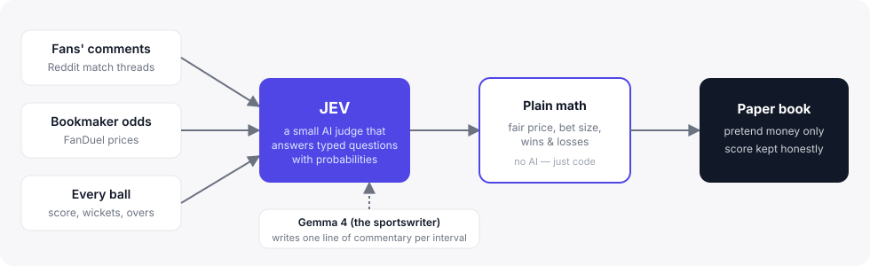
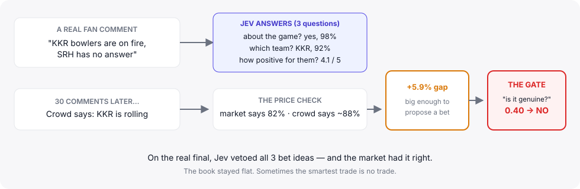

# ipl-sentiment-trading

**Cricket fans argue online. Bookmakers set prices. This project asks: when the crowd disagrees with the price, who's right?**

It replays the IPL 2024 season — saved match data, saved comments, saved odds — and lets an AI judge the mood of the crowd every few minutes. If the crowd's mood and the price disagree enough, it makes a *pretend* bet and keeps score. No real money ever moves.

## The story in one picture



## The idea

- Every few minutes of a match, fans post comments like *"KKR are on fire!"*
- At the same time, the bookmaker's odds say how likely each team is to win.
- This project reads the comments, works out which team the crowd believes in, and compares that to the price.
- If the crowd is more excited than the price — or less — there might be an opportunity. It pretends to bet, then checks at the end whether the bet would have won.

The whole thing runs on old data. Think of it as a flight simulator for a trading idea, not a betting app.

## Meet Jev — the judge

The hard part isn't math. It's *judgment*: is a comment really about the match? Which team does it support? Is the crowd's edge real, or just noise?

**Jev** is a small AI model built for exactly this. You give it a situation (the comments, the score, the odds) plus a list of typed questions, and it answers every question in one go — with probabilities, not guesses:

- *"Is this comment about the game?"* → yes/no, with a probability
- *"Which team is it about?"* → KKR / SRH / neither, with probabilities
- *"How upbeat is it?"* → a score from 0 to 5

Because all the questions go in one request, reading 30 comments costs about as much as reading one — and every single answer is written down in a log you can audit.


**Important:** Jev never does arithmetic. Fair prices, bet sizes, and winnings are plain code — you can check every number by hand.

## A real decision, step by step

On the 2024 final (KKR vs SRH), the crowd leaned hard toward KKR — but the market already knew that. Here's one moment, exactly as it happened:



That's the point of the gate: before any pretend bet, Jev is asked one last question — *"is this edge genuine?"* A value below 50% vetoes the proposal only when Jev supplies a valid NoulA gate answer; an omitted or non-NoulA answer skips the veto, so the fill may still be recorded. On this match it said **no all three times**, and it was right: KKR won big, and the flat book lost nothing.

## What actually happened on the final

| Measured, not guessed | Value |
|---|---|
| Jev calls | 82 |
| Typed answers | 3,648 |
| Total cost | about **$0.40** |
| Speed per call | ~100 ms |
| Bets taken | **0** (all 3 proposals vetoed) |
| Commentary written | 30 of 38 intervals |

*Jev is slightly nondeterministic — re-running the same match can move small numbers a little.*

## What it looks like

`ipl-ui` serves a small web dashboard: pick a match, press Analyze, replay the game interval by interval — price vs. crowd view, the paper account, and every Jev decision laid out as chips and tables.


## Try it

You need Python 3.11+ and Node 18+.

```bash
python -m venv .venv && .venv/bin/pip install -e ".[dev]"
.venv/bin/pytest                                  # all 36 tests run offline
.venv/bin/ipl-analyze analyze 74 --sentiment vader # works with zero API keys

export TYPESAFE_API_KEY=...   # turns on Jev
export GEMINI_API_KEY=...     # turns on the commentary writer
.venv/bin/ipl-analyze analyze 74 --sentiment jev --narrative
.venv/bin/ipl-analyze eval 74 --sentiment jev      # Jev vs. baseline + cost report

cd web && npm install && npm run build && cd ..   # build the UI once
.venv/bin/ipl-ui              # open http://localhost:8000
```

See `.env.example` for all the keys. Without keys everything still works — sentiment falls back to the offline VADER baseline and there's no commentary.

## Words you might not know

- **Paper trading** — pretending to bet, keeping score honestly.
- **Odds → probability** — a bookmaker's price implies a win chance, minus a built-in fee we remove first ("de-vig").
- **Edge** — the gap between our view and the market's.
- **Kelly staking** — a cautious formula for "how much to risk": tiny edges get tiny bets.
- **Gate veto** — Jev's last-minute "I don't believe this edge is real" no.
- **VADER** — the classic word-list sentiment tool; our free baseline that needs no AI keys.

## Where things live

```
data/            the saved 2024 season — comments, balls, odds (read-only)
src/ipl_sentiment_trading/
  jev/           talking to Jev: client, questions, the audit log
  sentiment/     turning comments into a crowd score
  market/        bookmaker prices → fair probabilities
  signal/ policy/ ledger/   the math: view → size → pretend book
  narrate/       Gemma 4 commentary, routed by Jev's drama score
  pipeline/ eval/ ui/       run it / measure it / show it
web/             the React + StyleX dashboard
ARCHITECTURE.md  the design spec for grown-ups
```

## The fine print

This is a research demo. It's not live betting, it's not a broker, and past cricket games don't predict anything else. The saved data is the product; the AI prose is decoration.
